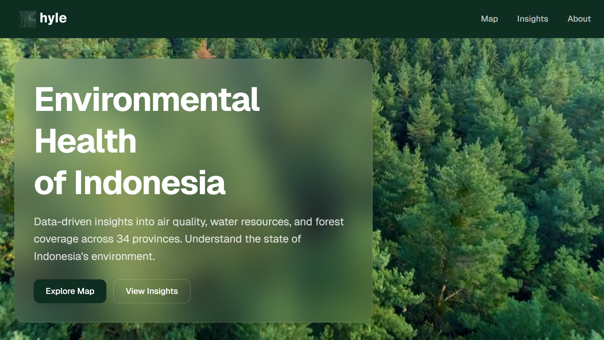

# Hyle

Environmental monitoring and visualization platform.

## Concept
Hyle is a minimalist platform designed for monitoring environmental data across different regions, providing interactive visualizations and data-driven insights.

## Features
- **Interactive Map**: Visualize geo-boundaries and environmental indicators using MapLibre GL.
- **Data Insights**: Detailed analysis and statistics for regency-level environmental data.
- **Content Management**: Integrated blog and insights system for environmental reporting.
- **Admin Dashboard**: Secure management of users, content, and data requests.

## Tech Stack
- **Framework**: Next.js 16 (React 19)
- **Styling**: Tailwind CSS & Shadcn UI
- **Database**: PostgreSQL
- **Mapping**: MapLibre GL
- **Auth**: JWT-based authentication

## Setup

1. **Install dependencies**:
   ```bash
   npm install
   ```

2. **Environment Configuration** (Optional, defaults are provided):
   Create a `.env` file:
   ```env
   DB_USER=postgres
   DB_HOST=localhost
   DB_NAME=hyle
   DB_PASSWORD=postgres
   DB_PORT=5432
   JWT_SECRET=your_secret_key
   ```

3. **Start the development server**:
   ```bash
   npm run dev
   ```
   Access the app at `http://localhost:3000`.
